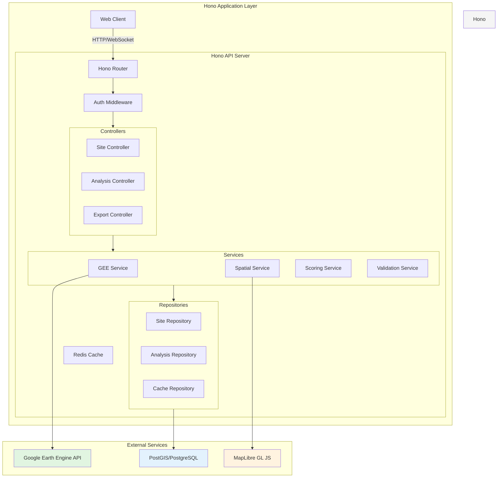
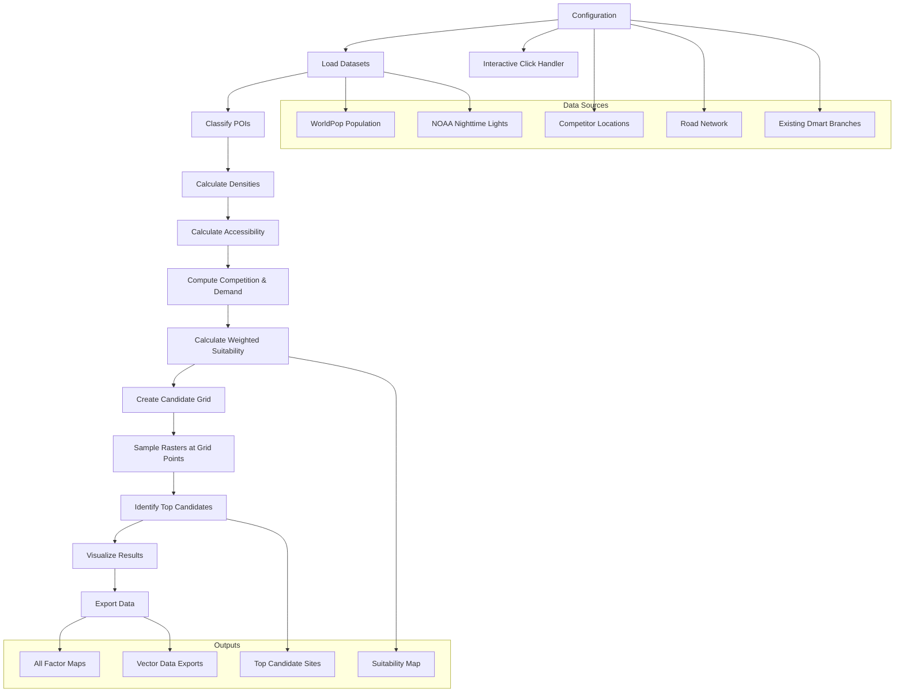

![[Pasted image 20251127175536.png]]

### Todo : 
- Understanding the Site Suitability.
- Creating the Worker
- Following , clean code documentation. 
- Adding notes on each files and services.
- Following structure : 
```
project/
├── src/
│   ├── routes/        # HTTP endpoints, wiring only
│   ├── controllers/   # Parse input, call services, send response
│   ├── services/      # Business logic
│   ├── models/        # DB models / ORM entities
│   ├── middlewares/   # Auth, logging, validation
│   ├── utils/         # Helpers
│   ├── config/        # Env, DB config
│   └── app.(js|py|go) # App entry
├── tests/
├── .env
└── package.json / pyproject.toml / go.mod
```
- Based on the image and your instructions, I'll help you structure the site suitability application following the provided directory structure and clean code principles. Let me outline the implementation steps:

# **Retail Site Selection Optimizer - Implementation Plan**

## **Overview**
This plan outlines the migration of the Google Earth Engine (GEE) retail site selection system to a **Hono-based web application**. The application will provide interactive retail location analytics with real-time suitability scoring, spatial queries, and comprehensive reporting capabilities.

## **Architecture Diagram**



## **Implementation Phases**

### **Phase 1: Project Setup & Foundation**
**Duration: 1-2 weeks**

1. **Project Initialization**
   - Set up Hono project with TypeScript
   - Configure build tools (tsup/esbuild)
   - Set up linting (ESLint) and formatting (Prettier)
   - Configure testing framework (Vitest)

2. **Core Infrastructure**
   - Establish directory structure following Clean Architecture
   - Set up environment configuration management
   - Implement dependency injection container
   - Configure logging system (Pino)

3. **Database Setup**
   - Install and configure PostgreSQL with PostGIS extension
   - Set up connection pooling
   - Create migration system (Drizzle ORM or similar)

### **Phase 2: Core Domain & Data Models**
**Duration: 2-3 weeks**

1. **Domain Models Design**
   - Define core entities:
     - `SiteCandidate` (location with suitability scores)
     - `Competitor` (direct/indirect classification)
     - `Attractor` (POI categories)
     - `SpatialLayer` (raster/vector data)
   - Implement value objects for coordinates, scores, weights

2. **Repository Layer**
   - Create base repository interface
   - Implement PostGIS spatial queries
   - Add caching layer (Redis) for frequent queries
   - Set up connection management

3. **Validation Layer**
   - Implement input validation (Zod)
   - Add spatial data validation
   - Create custom validators for coordinates, bounds

### **Phase 3: GEE Integration Service**
**Duration: 3-4 weeks**

1. **GEE Client Service**
   - Create authenticated GEE API client
   - Implement retry logic with exponential backoff
   - Add request batching for efficiency
   - Set up result caching strategy

2. **Raster Processing Service**
   - Port normalization algorithms from GEE script
   - Implement kernel density estimation
   - Create compositing service for multiple layers
   - Add progress tracking for long-running operations

3. **Spatial Analysis Service**
   - Implement buffer analysis
   - Create proximity scoring algorithms
   - Add competition density calculations
   - Implement demand pull computations

### **Phase 4: Business Logic Layer**
**Duration: 2-3 weeks**

1. **Scoring Engine**
   - Implement weighted suitability scoring
   - Create configurable weight management
   - Add custom scoring rules engine
   - Implement ranking algorithms

2. **Site Selection Service**
   - Create grid generation algorithms
   - Implement candidate filtering
   - Add constraint application (exclusion zones)
   - Create optimization algorithms

3. **Analysis Service**
   - Implement comparative analysis
   - Add trend detection
   - Create reporting templates
   - Implement what-if scenario modeling

### **Phase 5: API Layer & Controllers**
**Duration: 2 weeks**

1. **REST API Design**
   - Define OpenAPI/Swagger specification
   - Implement Hono route handlers
   - Add request/response DTOs
   - Implement error handling middleware

2. **Controller Implementation**
   - Site selection controller
   - Analysis controller
   - Export controller
   - Configuration controller

3. **Middleware & Security**
   - Implement authentication (JWT/OAuth)
   - Add rate limiting
   - Implement CORS configuration
   - Add request logging

### **Phase 6: Frontend Integration**
**Duration: 3-4 weeks**

1. **Map Visualization Layer**
   - Integrate MapLibre GL JS
   - Implement layer management system
   - Add interactive controls
   - Create popup/click handlers

2. **UI Components**
   - Build layer toggle controls
   - Implement analysis panel
   - Create results table with sorting/filtering
   - Add export controls

3. **Interactive Features**
   - Port click-popup functionality
   - Implement buffer visualization
   - Add real-time scoring display
   - Create comparison tools

### **Phase 7: Export & Reporting**
**Duration: 1-2 weeks**

1. **Data Export Service**
   - Implement shapefile export
   - Add CSV/Excel generation
   - Create PDF report generation
   - Implement batch export

2. **Visualization Export**
   - Add map image export
   - Implement chart generation
   - Create dashboard exports
   - Add print-friendly layouts

### **Phase 8: Performance & Optimization**
**Duration: 1-2 weeks**

1. **Caching Strategy**
   - Implement multi-level caching
   - Add cache invalidation logic
   - Create cache warming mechanisms
   - Implement background refresh

2. **Performance Tuning**
   - Optimize database queries
   - Implement connection pooling
   - Add query result compression
   - Optimize GEE API calls

3. **Monitoring & Metrics**
   - Add performance monitoring
   - Implement health checks
   - Add usage analytics
   - Create alerting system

### **Phase 9: Testing & Quality Assurance**
**Duration: 2 weeks**

1. **Test Strategy**
   - Unit tests for services and utilities
   - Integration tests for API endpoints
   - Spatial data validation tests
   - Performance and load testing

2. **Quality Gates**
   - Code coverage requirements
   - Performance benchmarks
   - Security scanning
   - Accessibility testing

### **Phase 10: Deployment & Documentation**
**Duration: 1 week**

1. **Deployment Pipeline**
   - Set up CI/CD (GitHub Actions)
   - Configure environment-specific builds
   - Implement blue-green deployment
   - Set up rollback procedures

2. **Documentation**
   - API documentation (OpenAPI)
   - User guide
   - Developer setup guide
   - Deployment guide

## **Clean Code Practices Implementation**

### **1. Code Organization**
- **Domain-Driven Design** structure
- **Dependency Injection** for loose coupling
- **Repository Pattern** for data access
- **Service Layer** for business logic

### **2. Type Safety**
- Full TypeScript implementation
- Strict null checking
- Custom type guards for spatial data
- Runtime validation with Zod

### **3. Error Handling**
- Custom error hierarchy
- Global error middleware
- Structured logging
- Graceful degradation

### **4. Testing Strategy**
- Test pyramid approach
- Mock external dependencies
- Integration test database
- E2E test critical user flows

### **5. Configuration Management**
- Environment-based configuration
- Secrets management
- Feature flags
- Runtime configuration reloading

## **Key Technical Decisions**

1. **Map Library**: MapLibre GL JS (open source, WebGL-based)
2. **Spatial Database**: PostgreSQL + PostGIS
3. **Caching**: Redis for frequent queries
4. **API Documentation**: OpenAPI 3.0 with Swagger UI
5. **Authentication**: JWT with refresh tokens
6. **File Export**: Combined server-side generation and client-side streaming
7. **Real-time Updates**: WebSocket for long-running spatial analyses
8. **Monitoring**: OpenTelemetry for distributed tracing

## **Success Metrics**

1. **Performance**: < 2s response time for site scoring
2. **Scalability**: Support 100 concurrent users
3. **Reliability**: 99.9% uptime for core features
4. **Data Freshness**: < 24h for GEE data updates
5. **Accuracy**: > 95% match with original GEE script results

## **Risk Mitigation**

1. **GEE API Limits**: Implement request queuing and caching
2. **Large Spatial Queries**: Implement pagination and streaming
3. **Browser Memory**: Implement tile-based rendering for large datasets
4. **Data Consistency**: Implement data versioning and validation
5. **Third-party Dependencies**: Maintain fallback mechanisms

This phased approach ensures systematic development with clear milestones, allowing for iterative testing and feedback incorporation while maintaining code quality through Clean Code practices.

=======================================================

# **Understanding the Code**
---

# Retail Site Selection Optimizer - Code Documentation

## Overview

This Google Earth Engine script identifies optimal retail branch locations in Maharashtra, India, by analyzing multiple factors including population density, accessibility, competition, and attraction points. The tool uses a weighted scoring system to evaluate potential sites and provides both visualization and export capabilities.

  

## Workflow Diagram

  



  

## Code Structure and Documentation

  

### 1. Configuration Section

  

```javascript

// ======================= CONFIG =======================

var region = ee.FeatureCollection("projects/site-selection-optimizer/assets/Maharashtra_Boundary_Final").geometry();

var competitors = ee.FeatureCollection("projects/site-selection-optimizer/assets/Competitors_Maha_All");

var dmart = ee.FeatureCollection("projects/site-selection-optimizer/assets/Dmart_Branches");

var roads = ee.FeatureCollection("projects/site-selection-optimizer/assets/Road_Maharashtra");

  

var SCALE_RASTER = 500; // meters - resolution for raster calculations

var GRID_SPACING = 5000; // meters - spacing between candidate grid points

var travelTimeAssetId = null; // optional network travel-time raster (set if available)

```

  

**Purpose**: Sets up the study region (Maharashtra), loads required datasets, and defines processing parameters.

  

### 2. Datasets Section

  

```javascript

// ======================= DATASETS =======================

var pop = ee.ImageCollection("WorldPop/GP/100m/pop")

            .filterDate('2020-01-01','2020-12-31')

            .select('population')

            .mean()

            .reproject('EPSG:3857', null, SCALE_RASTER)

            .clip(region);

  

var ntl = ee.ImageCollection("NOAA/VIIRS/DNB/MONTHLY_V1/VCMCFG")

            .filterDate('2023-01-01','2023-12-31')

            .select('avg_rad')

            .mean()

            .reproject('EPSG:3857', null, SCALE_RASTER)

            .clip(region);

```

  

**Purpose**: Loads and processes population data from WorldPop and nighttime lights data from NOAA VIIRS.

  

### 3. POI Classification Section

  

```javascript

// ======================= POI CLASSIFICATION =======================

function classifyFeature(f) {

  // Extracts relevant properties from features

  var getSafe = function(prop) { return ee.String(ee.Algorithms.If(f.get(prop), f.get(prop), '')).toLowerCase(); };

  var desc = getSafe('shop').cat(' ')

            .cat(getSafe('amenity')).cat(' ')

            .cat(getSafe('amenity_1')).cat(' ')

            .cat(getSafe('brand')).cat(' ')

            .cat(getSafe('tourism')).cat(' ')

            .cat(getSafe('restaurant')).cat(' ')

            .cat(getSafe('cafe'));

  

  // Classifies based on description matching patterns

  var type = ee.Algorithms.If(

    desc.match('supermarket|mart|convenience|department|grocery|dmart|bazaar|more|reliance|vishal|dairy|hyper', 'i').size().gt(0), 'direct_competitor',

    ee.Algorithms.If(

      desc.match('mall|clothes|apparel|electronics|mobile|shoes|beauty|shopping|store', 'i').size().gt(0), 'indirect_competitor',

      ee.Algorithms.If(

        desc.match('school|college|university|hospital|clinic|pharmacy|bus|restaurant|fast_food|cafe|parking|hotel|attraction|museum|park', 'i').size().gt(0), 'attractor',

        'other'

      )

    )

  );

  return f.set('type', type);

}

  

// Apply classification and create separate collections

var classified = competitors.map(classifyFeature);

var direct = classified.filter(ee.Filter.eq('type','direct_competitor'));

var indirect = classified.filter(ee.Filter.eq('type','indirect_competitor'));

var attractor = classified.filter(ee.Filter.eq('type','attractor'));

```

  

**Purpose**: Classifies points of interest into three categories:

- Direct competitors: supermarkets, marts, grocery stores

- Indirect competitors: malls, clothing stores, electronics stores

- Attractors: schools, hospitals, restaurants, parks, etc.

  

### 4. Utility Functions Section

  

```javascript

// ======================= UTILITY FUNCTIONS =======================

// Safely converts values to numbers, replacing null with 0

function safeNumber(val){

  return ee.Number(ee.Algorithms.If(ee.Algorithms.IsEqual(val, null), 0, val));

}

  

// Normalizes image values to 0-1 range using percentile stretching

function normalize(img, suffix){

  var band = ee.String(img.bandNames().get(0));

  var stats = img.reduceRegion({

    reducer: ee.Reducer.percentile([2,98]),

    geometry: region,

    scale: SCALE_RASTER,

    bestEffort:true,

    maxPixels:1e13

  });

  var min = ee.Number(ee.Algorithms.If(stats.get(band.cat('_p2')), stats.get(band.cat('_p2')), 0));

  var max = ee.Number(ee.Algorithms.If(stats.get(band.cat('_p98')), stats.get(band.cat('_p98')), 1));

  var scaled = ee.Image(ee.Algorithms.If(max.gt(min), img.unitScale(min,max), img.multiply(0)));

  return scaled.rename(band.cat('_').cat(suffix)).clamp(0,1).unmask(0);

}

  

// Creates kernel density surface from point features

function densityFromPoints(fc, regionGeom, radiusMeters){

  var fcConst = fc.map(function(f){return f.set('const',1);});

  var counts = fcConst.reduceToImage(['const'], ee.Reducer.sum())

                .reproject('EPSG:3857', null, SCALE_RASTER)

                .unmask(0).clip(regionGeom);

  var zeros = counts.eq(0).selfMask();

  var dist = zeros.distance(ee.Kernel.euclidean(1)).multiply(SCALE_RASTER).unmask(0);

  var sigma = radiusMeters/3.0;

  var decay = dist.expression('exp(-0.5*((d)/s)**2)', {d: dist, s: sigma});

  return counts.multiply(decay).rename('kd');

}

```

  

**Purpose**: Provides helper functions for:

- Safe number conversion

- Image normalization to 0-1 range

- Kernel density estimation from point features

  

### 5. Densities Section

  

```javascript

// ======================= DENSITIES =======================

var directKD = densityFromPoints(direct, region, 1000);

var indirectKD = densityFromPoints(indirect, region, 1000);

var attractorKD = densityFromPoints(attractor, region, 1000);

  

// Normalize density surfaces

var directN = normalize(directKD, 'direct');

var indirectN = normalize(indirectKD, 'indirect');

var attractorN = normalize(attractorKD, 'attractor');

var popN = normalize(pop,'pop');

var ntlN = normalize(ntl,'ntl');

```

  

**Purpose**: Calculates kernel density surfaces for direct competitors, indirect competitors, and attractors using a 1000m radius. Then normalizes all density surfaces to a 0-1 range.

  

### 6. Accessibility Section

  

```javascript

// ======================= ACCESSIBILITY =======================

var accessN;

if(travelTimeAssetId){

  // If network travel-time data is available, use it

  var tt = ee.Image(travelTimeAssetId)

             .reproject('EPSG:3857', null, SCALE_RASTER)

             .clip(region);

  accessN = normalize(tt.multiply(-1),'access_tt');

  print('Using network travel-time accessibility');

}else{

  // Otherwise use Euclidean distance to roads

  var roadsConst = roads.map(function(f){return f.set('const',1);});

  var roadRaster = roadsConst.reduceToImage(['const'], ee.Reducer.sum())

                    .reproject('EPSG:3857', null, SCALE_RASTER)

                    .unmask(0).clip(region);

  var roadZeros = roadRaster.eq(0).selfMask();

  var distRoad = roadZeros.distance(ee.Kernel.euclidean(1)).multiply(SCALE_RASTER).unmask(0);

  accessN = normalize(distRoad.multiply(-1),'access_euc');

  print('Warning: Using Euclidean distance to roads for accessibility');

}

```

  

**Purpose**: Calculates accessibility as either:

- Network travel-time (if available)

- Euclidean distance to roads (fallback option)

  

The accessibility is normalized so that higher values indicate better accessibility.

  

### 7. Competition & Demand Section

  

```javascript

// ======================= COMPETITION & DEMAND =======================

var compRaw = directN.multiply(1.0).add(indirectN.multiply(0.5));

var compN = normalize(compRaw,'comp');

var demandPull = attractorN.multiply(0.8).rename('demand');

```

  

**Purpose**: Calculates:

- Competition pressure: weighted sum of direct competitors (weight 1.0) and indirect competitors (weight 0.5)

- Demand pull: based on attractor locations (weight 0.8)

  

### 8. Weighted Suitability Section

  

```javascript

// ======================= WEIGHTED SUITABILITY =======================

var w_pop=0.35, w_ntl=0.2, w_access=0.2, w_demand=0.15, w_comp=0.2;

  

var suitability = popN.multiply(w_pop)

                  .add(ntlN.multiply(w_ntl))

                  .add(accessN.multiply(w_access))

                  .add(normalize(demandPull,'demand').multiply(w_demand))

                  .subtract(compN.multiply(w_comp))

                  .rename('suitability')

                  .clip(region)

                  .unmask(0);

suitability = normalize(suitability,'final');

```

  

**Purpose**: Combines all factors into a final suitability score using weighted sum:

- Population: 35%

- Nighttime lights: 20%

- Accessibility: 20%

- Demand pull: 15%

- Competition pressure: subtracted with 20% weight

  

The final suitability is normalized to a 0-1 range.

  

### 9. Candidate Grid Section

  

```javascript

// ======================= CANDIDATE GRID =======================

var spacing = ee.Number(GRID_SPACING);

var bounds = region.bounds();

var coords = ee.List(bounds.coordinates().get(0));

var lonList = coords.map(function(pt){return ee.Number(ee.List(pt).get(0));});

var latList = coords.map(function(pt){return ee.Number(ee.List(pt).get(1));});

var minX = ee.Number(lonList.reduce(ee.Reducer.min()));

var maxX = ee.Number(lonList.reduce(ee.Reducer.max()));

var minY = ee.Number(latList.reduce(ee.Reducer.min()));

var maxY = ee.Number(latList.reduce(ee.Reducer.max()));

var degSpacing = spacing.divide(111320);

var xCount = maxX.subtract(minX).divide(degSpacing).floor();

var yCount = maxY.subtract(minY).divide(degSpacing).floor();

  

var candidates = ee.FeatureCollection(

  ee.List.sequence(0,xCount).map(function(i){

    var x = minX.add(ee.Number(i).multiply(degSpacing)).add(degSpacing.divide(2));

    return ee.List.sequence(0,yCount).map(function(j){

      var y = minY.add(ee.Number(j).multiply(degSpacing)).add(degSpacing.divide(2));

      return ee.Feature(ee.Geometry.Point([x,y]));

    });

  }).flatten()

).filterBounds(region);

```

  

**Purpose**: Creates a regular grid of candidate sites across the region with spacing defined by GRID_SPACING (5000m by default).

  

### 10. Sample to Grid Section

  

```javascript

// ======================= SAMPLE TO GRID =======================

var sampleFields = suitability.addBands([popN, ntlN, accessN, normalize(demandPull,'demand'), compN]);

  

var candidatesWithFeatures = sampleFields.sampleRegions({

  collection: candidates,

  scale: SCALE_RASTER,

  geometries: true

}).map(function(f) {

  var suitability = safeNumber(f.get('suitability_final'));

  var popVal = safeNumber(f.get('popN_pop'));

  var ntlVal = safeNumber(f.get('ntlN_ntl'));

  var accessVal = safeNumber(f.get('accessN_access_euc')).add(safeNumber(f.get('accessN_access_tt')));

  var compVal = safeNumber(f.get('compN_comp'));

  

  return f.set({

    'suitability': suitability.multiply(1000).toInt(),

    'pop': popVal.multiply(1000).toInt(),

    'ntl': ntlVal.multiply(1000).toInt(),

    'access': accessVal.multiply(1000).toInt(),

    'comp': compVal.multiply(1000).toInt()

  });

});

```

  

**Purpose**: Samples all raster layers at each candidate grid point and attaches the values as properties to the features.

  

### 11. Top Candidates Section

  

```javascript

// ======================= TOP CANDIDATES =======================

var topN = candidatesWithFeatures.sort('suitability', false).limit(500);

  

// ======================= SUMMARY TABLE =======================

var top10 = topN.limit(10).map(function(f){

  var coords = f.geometry().coordinates();

  return ee.Feature(null, {

    'Longitude': coords.get(0),

    'Latitude': coords.get(1),

    'Suitability': f.get('suitability'),

    'Population': f.get('pop'),

    'NTL': f.get('ntl'),

    'Accessibility': f.get('access'),

    'Competition': f.get('comp')

  });

});

print('🔝 Top 10 Recommended Site Candidates (Ranked by Suitability):', top10);

```

  

**Purpose**: Identifies the top 500 candidate sites based on suitability and creates a summary table of the top 10 sites.

  

### 12. Map Visualization Section

  

```javascript

// ======================= MAP VISUALIZATION =======================

Map.centerObject(region, 7);

  

Map.addLayer(popN, {min:0, max:1, palette:['white','orange','red']}, 'Population');

Map.addLayer(ntlN, {min:0, max:1, palette:['black','purple','yellow']}, 'Night Lights');

Map.addLayer(accessN, {min:0, max:1, palette:['red','yellow','green']}, 'Accessibility');

Map.addLayer(compN, {min:0, max:1, palette:['green','yellow','red']}, 'Competitor Pressure');

Map.addLayer(demandPull, {min:0, max:1, palette:['white','blue']}, 'Demand Pull');

Map.addLayer(suitability, {min:0, max:1, palette:['red','yellow','green']}, 'Final Suitability');

  

Map.addLayer(direct, {color:'red'}, 'Direct Competitors');

Map.addLayer(indirect, {color:'orange'}, 'Indirect Competitors');

Map.addLayer(attractor, {color:'blue'}, 'Attractors');

Map.addLayer(roads, {color:'gray'}, 'Roads');

Map.addLayer(dmart, {color:'green'}, 'Existing Dmart');

Map.addLayer(topN.style({color:'lime', pointSize:5, pointShape:'circle'}), {}, 'Top Candidate Points');

```

  

**Purpose**: Adds all relevant layers to the map for visualization, using appropriate color schemes for each layer.

  

### 13. Exports Section

  

```javascript

// ======================= EXPORTS =======================

// Exports raster layers

Export.image.toDrive({

  image: suitability.multiply(1000).toInt16(),

  description:'Suitability_Maharashtra_500m',

  region: region,

  scale: SCALE_RASTER,

  crs:'EPSG:3857',

  maxPixels:1e13

});

  

// ... (similar exports for other raster layers)

  

// Exports vector data

Export.table.toDrive({

  collection: topN.select(['suitability','pop','ntl','access','comp']),

  description:'Top_Candidate_Points_Maha',

  fileFormat:'SHP'

});

  

// ... (similar exports for other vector layers)

```

  

**Purpose**: Exports all raster and vector layers to Google Drive for further analysis or use in other applications.

  

### 14. Interactive Click Handler Section

  

```javascript

// ======================= INTERACTIVE POPUP PANEL =======================

// Creates a side panel for displaying information

var clickPanel = ui.Panel({style: {width: '420px', padding: '10px', position: 'bottom-left'}});

clickPanel.add(ui.Label({

  value: '🧭 Retail Site Assessment (Click on Map)',

  style: {fontWeight: 'bold', fontSize: '18px', margin: '6px 0'}

}));

ui.root.insert(0, clickPanel);

  

// Creates a composite image for sampling

var composite = ee.Image.cat([

  suitability.rename('suitability'),

  popN.rename('population'),

  ntlN.rename('nightlights'),

  accessN.rename('accessibility'),

  compN.rename('competition'),

  demandPull.rename('demand')

]);

  

// Click handler function

Map.onClick(function(coords) {

  // Clears and updates the panel with clicked location info

  clickPanel.clear();

  clickPanel.add(ui.Label({

    value: '📍 Location: ' + coords.lon.toFixed(5) + ', ' + coords.lat.toFixed(5),

    style: {fontWeight: 'bold', fontSize: '14px'}

  }));

  

  // Creates a buffer around the clicked point

  var point = ee.Geometry.Point([coords.lon, coords.lat]);

  var buffer = point.buffer(2000);

  

  // Counts features within the buffer

  var directInBuffer = direct.filterBounds(buffer);

  var indirectInBuffer = indirect.filterBounds(buffer);

  var attractorInBuffer = attractor.filterBounds(buffer);

  var dmartInBuffer = dmart.filterBounds(buffer);

  var roadsInBuffer = roads.filterBounds(buffer);

  

  // Calculates road length in the buffer

  var roadLengthKm = roadsInBuffer

    .map(function(f) { return f.set('length_km', f.geometry().length().divide(1000)); })

    .aggregate_sum('length_km');

  

  // Samples raster values at the clicked point and within the buffer

  var sampled = composite.sample({

    region: point,

    scale: SCALE_RASTER,

    numPixels: 1

  }).first();

  

  // Calculates mean values within the buffer

  var reducers = ee.Reducer.mean();

  var stats = ee.Dictionary({

    suitability: suitability.reduceRegion({reducer: reducers, geometry: buffer, scale: SCALE_RASTER, bestEffort: true}),

    pop: popN.reduceRegion({reducer: reducers, geometry: buffer, scale: SCALE_RASTER, bestEffort: true}),

    ntl: ntlN.reduceRegion({reducer: reducers, geometry: buffer, scale: SCALE_RASTER, bestEffort: true}),

    access: accessN.reduceRegion({reducer: reducers, geometry: buffer, scale: SCALE_RASTER, bestEffort: true}),

    comp: compN.reduceRegion({reducer: reducers, geometry: buffer, scale: SCALE_RASTER, bestEffort: true}),

    demand: demandPull.reduceRegion({reducer: reducers, geometry: buffer, scale: SCALE_RASTER, bestEffort: true})

  });

  

  // Evaluates the sampled data and updates the panel

  sampled.evaluate(function(sampledObj) {

    stats.evaluate(function(vals) {

      // Helper functions for extracting values

      function getReduceMean(obj) { /* ... */ }

      function safeGetSample(sample, key) { /* ... */ }

  

      // Extracts values for display

      // ... (value extraction code)

  

      // Calculates a decision score

      var score = (Number(bufSuit) * 0.3) + (Number(bufPop) * 0.2) + (Number(bufNtl) * 0.1) +

                  (Number(bufAcc) * 0.25) + (Number(bufDemand) * 0.15) - (Number(bufComp) * 0.15);

      var verdict = (score > 0.5) ? '✅ Highly suitable' :

                    (score > 0.35) ? '🟡 Moderately suitable' :

                    '❌ Not ideal — weak suitability or high competition';

  

      // Updates the panel with all the information

      // ... (panel update code)

  

      // Updates the map visualization

      Map.layers().reset();

      Map.addLayer(suitability, {min:0, max:1, palette:['#d73027','#fee08b','#1a9850']}, 'Suitability');

      Map.addLayer(buffer, {color: '#FFD700'}, '2 km buffer');

      Map.addLayer(ee.FeatureCollection([ee.Feature(point)]), {color:'#000000', pointSize:8}, 'Clicked Point');

      Map.addLayer(directInBuffer.style({color:'#ff3b3b', pointShape: 'triangle', pointSize:6}), {}, 'Nearby Direct');

      Map.addLayer(indirectInBuffer.style({color:'#ffa500', pointShape: 'square', pointSize:6}), {}, 'Nearby Indirect');

      Map.addLayer(attractorInBuffer.style({color:'#0077ff', pointShape: 'star5', pointSize:6}), {}, 'Nearby Attractors');

      Map.addLayer(dmartInBuffer.style({color:'#00cc66', pointShape: 'circle', pointSize:8}), {}, 'Nearby Dmarts');

      Map.addLayer(roads.style({color:'#8000ff', width:1}), {}, 'Roads');

    });

  });

});

```

  

**Purpose**: Implements an interactive click handler that:

1. Shows detailed information about any clicked location

2. Calculates statistics within a 2km buffer

3. Provides a suitability assessment

4. Updates the map to show relevant features in the buffer area

  

## Key Features

  

1. **Multi-factor Analysis**: Combines population, nighttime lights, accessibility, competition, and demand factors

2. **Weighted Scoring System**: Uses a customizable weighted approach to calculate suitability

3. **Interactive Assessment**: Provides detailed information for any clicked location

4. **Comprehensive Exports**: Exports all raster and vector layers for further analysis

5. **Visualization**: Includes multiple visualization options for all factors

  

## Usage

  

1. Run the script in Google Earth Engine

2. Wait for all layers to load

3. Click on any location to see detailed assessment

4. Use the exports to save results for further analysis

  

## Customization Options

  

1. Adjust weights in the "Weighted Suitability" section to prioritize different factors

2. Change GRID_SPACING to adjust candidate site density

3. Modify classification patterns in the "POI Classification" section

4. Adjust buffer size in the click handler for different analysis scales