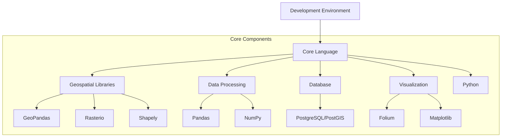
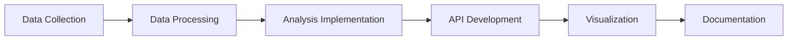

# Tech Stack for Local Development of Retail Site Selection Worker

## Overview

For local development of a retail site selection tool, I recommend a Python-based stack due to its rich geospatial ecosystem and data processing capabilities. Here's a comprehensive tech stack:



## Recommended Tech Stack

### 1. Core Language: Python
- **Version**: Python 3.9+
- **Package Manager**: pip or conda
- **Virtual Environment**: venv or conda environments

### 2. Geospatial Libraries
- **GeoPandas**: For working with geospatial vector data
- **Rasterio**: For reading and writing raster files
- **Shapely**: For manipulation and analysis of geometric objects
- **Pyproj**: For cartographic projections and coordinate transformations
- **GDAL/OGR**: For geospatial data translation (often installed as a dependency)

### 3. Data Processing & Analysis
- **Pandas**: For data manipulation and analysis
- **NumPy**: For numerical operations
- **Scikit-learn**: For machine learning algorithms (if needed for classification)
- **Scipy**: For scientific computing

### 4. Database
- **PostgreSQL with PostGIS**: For storing and querying geospatial data
- **SQLite with Spatialite**: For a lightweight alternative during development

### 5. Visualization
- **Folium**: For interactive maps
- **Matplotlib**: For plotting and visualization
- **Plotly**: For interactive visualizations
- **Kepler.gl**: For advanced geospatial visualization

### 6. API Development (for local testing)
- **FastAPI**: For building APIs to test the worker functionality
- **Flask**: As a simpler alternative to FastAPI

### 7. Development Tools
- **Jupyter Notebook**: For interactive development and visualization
- **VS Code**: As a code editor with Python and geospatial extensions
- **Docker**: For containerizing the application (optional but recommended)

## Local Development Setup

### Installation Steps

1. **Create a virtual environment**:
```bash
python -m venv retail_site_env
source retail_site_env/bin/activate  # On Windows: retail_site_env\Scripts\activate
```

2. **Install core packages**:
```bash
pip install geopandas rasterio shapely pyproj pandas numpy scipy scikit-learn
```

3. **Install database**:
```bash
# For PostgreSQL (requires separate installation of PostgreSQL server)
pip install psycopg2-binary

# For SQLite (comes with Python)
pip install pysqlite3
```

4. **Install visualization tools**:
```bash
pip install folium matplotlib plotly
```

5. **Install API development tools**:
```bash
pip install fastapi uvicorn  # For FastAPI
# or
pip install flask  # For Flask
```

### Development Workflow



## Sample Project Structure

```
retail_site_selection/
├── data/
│   ├── raw/              # Raw data files
│   ├── processed/        # Processed data
│   └── sample/           # Sample data for testing
├── src/
│   ├── data_processing/  # Data processing modules
│   ├── analysis/         # Analysis algorithms
│   ├── api/              # API endpoints
│   └── utils/            # Utility functions
├── notebooks/            # Jupyter notebooks for exploration
├── docs/                 # Documentation
├── requirements.txt      # Python dependencies
└── README.md             # Project documentation
```

## Local Implementation Example

Here's how you might structure the core analysis function in Python:

```python
# src/analysis/site_suitability.py
import geopandas as gpd
import rasterio
from rasterio.features import rasterize
import numpy as np
from scipy.ndimage import gaussian_filter

def calculate_suitability(coordinates, population_data, poi_data, road_data):
    """
    Calculate site suitability based on multiple factors.
    
    Args:
        coordinates: Tuple of (longitude, latitude)
        population_data: Path to population raster file
        poi_data: Path to POI shapefile
        road_data: Path to road network shapefile
        
    Returns:
        Dictionary with suitability scores and factors
    """
    # Create a buffer around the coordinates
    point = gpd.points_from_xy([coordinates[0]], [coordinates[1]])
    buffer = point.buffer(0.05)  # ~5km buffer
    
    # Load and process population data
    with rasterio.open(population_data) as pop_src:
        population = pop_src.read(1)
        population_transform = pop_src.transform
        
    # Extract population within buffer
    mask = rasterize(buffer.shapes, out_shape=population.shape, transform=population_transform)
    masked_pop = np.where(mask == 1, population, 0)
    pop_score = np.mean(masked_pop) / np.max(population)  # Normalized score
    
    # Process POI data
    pois = gpd.read_file(poi_data)
    pois_in_buffer = gpd.clip(pois, buffer)
    
    # Classify POIs and calculate competition score
    direct_competitors = pois_in_buffer[pois_in_buffer['type'] == 'direct_competitor']
    indirect_competitors = pois_in_buffer[pois_in_buffer['type'] == 'indirect_competitor']
    attractors = pois_in_buffer[pois_in_buffer['type'] == 'attractor']
    
    # Calculate competition density
    comp_score = (len(direct_competitors) * 1.0 + len(indirect_competitors) * 0.5) / 10  # Normalized
    
    # Calculate attractor density
    attractor_score = len(attractors) / 5  # Normalized
    
    # Process road data for accessibility
    roads = gpd.read_file(road_data)
    roads_in_buffer = gpd.clip(roads, buffer)
    road_length = roads_in_buffer.length.sum() / 1000  # in km
    access_score = min(road_length / 50, 1.0)  # Normalized, max at 50km
    
    # Calculate weighted suitability
    w_pop = 0.35
    w_access = 0.2
    w_attractor = 0.15
    w_comp = 0.3  # Competition has negative impact
    
    suitability = (pop_score * w_pop + 
                  access_score * w_access + 
                  attractor_score * w_attractor - 
                  comp_score * w_comp)
    
    return {
        'coordinates': coordinates,
        'suitability': max(0, min(1, suitability)),  # Clamp between 0 and 1
        'factors': {
            'population': pop_score,
            'accessibility': access_score,
            'attractors': attractor_score,
            'competition': comp_score
        }
    }
```

## Local API Development with FastAPI

```python
# src/api/main.py
from fastapi import FastAPI
from src.analysis.site_suitability import calculate_suitability

app = FastAPI(title="Retail Site Selection API")

@app.post("/analyze")
async def analyze_site(coordinates: dict):
    """
    Analyze site suitability for given coordinates.
    
    Expected input format:
    {
        "longitude": 73.8567,
        "latitude": 18.5204
    }
    """
    try:
        result = calculate_suitability(
            (coordinates["longitude"], coordinates["latitude"]),
            "data/processed/population.tif",
            "data/processed/pois.shp",
            "data/processed/roads.shp"
        )
        return result
    except Exception as e:
        return {"error": str(e)}
```

## Advantages of This Stack for Local Development

1. **Rich Geospatial Ecosystem**: Python has extensive libraries for geospatial analysis
2. **Rapid Prototyping**: Jupyter notebooks allow for interactive exploration
3. **Scalable Architecture**: The code can be easily containerized and deployed later
4. **API Development**: FastAPI allows for easy creation of APIs for testing
5. **Visualization Tools**: Multiple options for visualizing results

This stack provides a solid foundation for developing the retail site selection worker locally, with the flexibility to adapt for different deployment environments later.